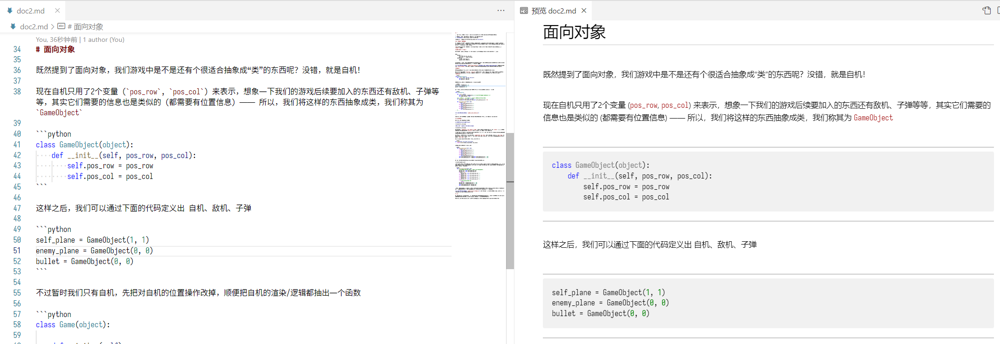

# 这是什么

[A站 - AcFun](https://www.acfun.cn/) 的文章区投稿编辑实在太难用了，并且目前并没有 Markdown 支持。而 Markdown 生成的 html 格式虽然可以被复制到编辑器，但最终排版效果也有些不尽人意，所以想自定义部分 Markdown 的渲染来让生成的格式好看一点，从 html 生成后不需要过多修改就能发布

# 功能

- [x] 在段落间添加换行
- [x] 在代码块 ("\`\`\`") 的前后添加分割线
- [ ] 提供设置来禁用本插件的渲染 (因为除了文章投稿外，并不需要这些奇怪的渲染方法)
- [ ] 上vscode商店 (然而真的有上的必要吗？)

# 效果展示

(上图的AC娘表情是粘贴后自机手动加的，与 Markdown 无关)

# 使用方法

## 安装

1. [下载 vsix](https://github.com/DaddyTrap/vscode-acfun-article-markdown-helper/releases)
2. vscode 中可以用 `Ctrl+Shift+P` 呼出命令面板，输入 vsix 找到 **从 VSIX 安装**
3. 选择上面下载的 vsix 即可安装

## 使用

1. 正常写 Markdown
2. 在启用该插件的状态下，使用 vscode 的预览 markdown 功能
3. 【可选】调整 vscode 主题，让预览中的文字颜色变成更易看清的黑色，比如可以更换为默认的浅色主题
4. 全选复制预览中的文本，粘贴到A站文章区编辑器

# 文章区编辑器坑

1. 如果文章中存在半角单引号 ("`'`") ，则在 **预览内容** 时会提示 “数据传输失败……” 。暂未测试这种情况下 **发布内容** 是否能正常发布。
